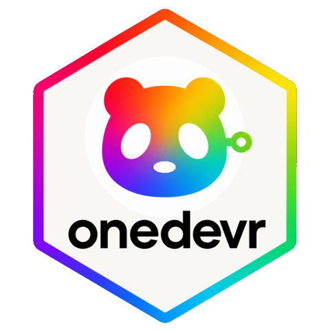

# onedevR 

`onedevr` is an R client for the [OneDev](https://onedev.io) REST API — issues,
projects, builds, and pull requests, for OneDev.

**References:**

- R package shape (GitLab → R): [`gitlabr`](https://thinkr-open.github.io/gitlabr/) —
  low-level `od_request()` escape hatch + high-level `od_*` wrappers, same idea
  as `gitlab` / `gl_*`.
- Working with OneDev itself: [`tod`](https://github.com/theonedev/tod)
  (TheOneDev CLI) — issue/PR/build refs, query DSL, and API conventions to
  mirror when implementing / extending `onedevr`.

## Motivation

`onedevr` was born from a practical constraint: **restricted development environments**.

Many corporate environments restrict tooling to essential languages only. If your development environment is confined to **R and Git**, you cannot use the official `tod` CLI (e.g., due to firewall restrictions or tooling policies). Yet you still need to interact with OneDev for:

- Running builds, managing artifacts, querying repositories
- Automating issue/PR workflows within R scripts or Quarto documents
- Leveraging AI-assisted coding workflows that need programmatic OneDev access

**`onedevr` solves this by:**
1. **Removing the `tod` dependency** — communicate directly with OneDev's REST API from R
2. **Enabling AI-assisted workflows** — your coding AI (Claude, etc.) can use `onedevr` to interact with OneDev on your behalf
3. **Being AI-efficient** — clean, predictable function naming (`od_*`), consistent parameter patterns, and comprehensive documentation so LLMs can reason about the API without ambiguity

If your constraint is "I have R, I have Git, I need OneDev", `onedevr` is for you.

## Status

**v1.0.0** — stable release with comprehensive documentation, workflow guides,
and developer tools. See [`NEWS.md`](NEWS.md) for details on recent changes.

## Install

```r
# GitHub
remotes::install_github("alexseymer/onedevR")
```

**Documentation:** (also available on [pkgdown site](https://alexseymer.github.io/onedevR/))
- [**Getting started**](vignettes/getting-started.Rmd) — Installation, config, basic workflows
- [**Issues workflow**](vignettes/issues-workflow.Rmd) — Querying, creating, updating, automation
- [**Builds workflow**](vignettes/builds-workflow.Rmd) — Build management, artifacts, CI/CD
- [**Pull requests workflow**](vignettes/pull-requests-workflow.Rmd) — PR review, commenting, merging
- [**Contributing**](CONTRIBUTING.md) — Development setup, testing, documentation standards

## Quick start

```r
library(onedevr)

# Env-based (fine for interactive use)
Sys.setenv(
  ONEDEV_HOST = "https://git.example.test",
  ONEDEV_API_TOKEN = "your-token",
  ONEDEV_PROJECT_PATH = "group/my-project"
)

od_query_issues(state = "Open")
issue <- od_get_issue(145)
fields <- od_get_issue_fields(145)

# Or an explicit connection (preferred in scripts)
conn <- od_connection(
  host = "https://git.example.test",
  token = Sys.getenv("ONEDEV_API_TOKEN"),
  project_path = "group/my-project"
)

iterations <- od_list_iterations(conn = conn)
created <- od_create_issue(
  title = "API test",
  description = "Created from R",
  fields = list(Priority = "Normal"),
  iteration_ids = iterations$id[1],
  conn = conn
)

od_issue_set_title(created$number, "API test (renamed)", conn = conn)
od_issue_transition_state(created$number, "Closed", conn = conn)

# Builds & pull requests
builds <- od_query_builds(status = "successful", count = 10L, conn = conn)
pr <- od_get_pull_request(1, conn = conn)
comments <- od_get_pull_request_comments(1, conn = conn)

# Projects & users
projects <- od_query_projects(count = 20L, conn = conn)
me <- od_get_me(conn = conn)
```

Copy [`.Renviron.example`](.Renviron.example) to `.Renviron` (gitignored) and
fill in your host/token/project. [`.env.example`](.env.example) is the same
variable list for non-R tooling. Live integration tests are gated behind
`ONEDEV_RUN_LIVE_TESTS=1`.

## v1.0.0 Highlights

✨ **Comprehensive documentation suite** for all major workflows
- In-depth vignettes covering issues, builds, and pull requests
- Real-world automation examples and best practices
- Troubleshooting guides and common patterns

🔧 **Developer-friendly tools**
- Contributing guide with setup instructions and testing patterns
- Roxygen2 documentation standards and examples
- Development environment configuration in Cursor Cloud / Docker

🚀 **Production-ready features**
- Pagination support for large result sets
- Flexible connection management (env vars or explicit objects)
- Low-level escape hatch (`od_request()`) for custom queries
- Comprehensive error handling and validation

## Design notes worth knowing up front

- **Issue / build / PR numbers are UI numbers, not internal IDs.** OneDev
  `#145` (what you see in the UI) is a different value from the internal REST
  `id`. The high-level API always takes the UI number; see §9 of the plan /
  `tod` ref formats. Resolution tries `projectPath#n`, then bare `#n` / `n`
  for OneDev versions that reject path-prefixed numbers.
- **Some OneDev endpoints accept more than one payload shape** depending on
  version/installation (e.g. issue creation, state transitions, iterations).
  `onedevr` tries known variants rather than picking one and failing silently
  on others — see §10 of the plan.
- **Custom issue fields are installation-specific.** There's no fixed schema;
  `fields` is treated as a named list.
- **Connections:** pass `conn = od_connection(...)` per call, or
  `od_set_connection(conn)` for a package default. Env vars remain the
  fallback. Bearer token is default; Basic Auth via `username`/`password`
  (or `ONEDEV_USERNAME` / `ONEDEV_PASSWORD`).
- **List queries return tibbles** by default (`od_query_issues()`, etc.).
  Use `as_tibble = FALSE` or `options(onedevr.as_tibble = FALSE)` for raw
  lists. Single-object getters stay as lists.

## Development

```r
devtools::load_all()
devtools::test()
devtools::document()
devtools::check()
```

## License

MIT — see [`LICENSE.md`](LICENSE.md).
