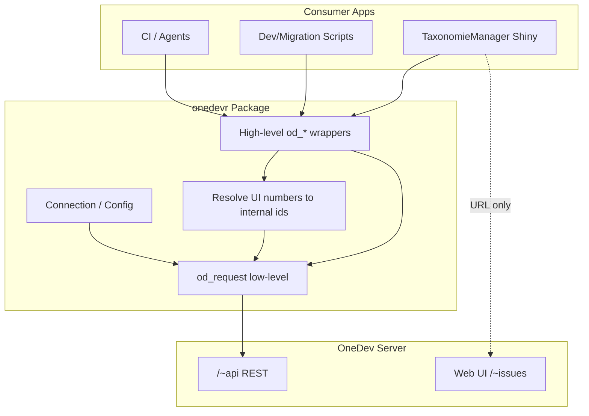
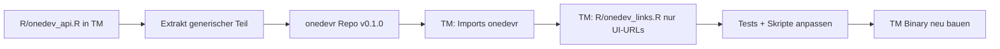

# onedevr — Plan für ein R-Paket (OneDev REST API Client)

**Stand:** 2026-07-10  
**Autor:** TaxonomieManager / Alexander Seymer  
**Ziel:** Eigenständiges R-Paket `onedevr` (Display-Name: **onedevR**), analog zu [gitlabr](https://thinkr-open.github.io/gitlabr/), das die OneDev-REST-API kapselt und aus dem bestehenden Code in `R/onedev_api.R` extrahiert wird.

---

## Inhaltsverzeichnis

1. [Executive Summary](#1-executive-summary)
2. [Motivation & Referenzmodell (gitlabr)](#2-motivation--referenzmodell-gitlabr)
3. [Ist-Zustand im TaxonomieManager](#3-ist-zustand-im-taxonomiemananger)
4. [Datei-Inventar & Abhängigkeiten](#4-datei-inventar--abhängigkeiten)
5. [Architektur-Vorschlag](#5-architektur-vorschlag)
6. [API-Design & Funktions-Mapping](#6-api-design--funktions-mapping)
7. [Vorhandene Code-Snippets (Extraktionsbasis)](#7-vorhandene-code-snippets-extraktionsbasis)
8. [Umgebungsvariablen & Konfiguration](#8-umgebungsvariablen--konfiguration)
9. [UI-Nummern vs. interne API-IDs](#9-ui-nummern-vs-interne-api-ids)
10. [Bekannte API-Quirks & Probedaten](#10-bekannte-api-quirks--probedaten)
11. [Phasen, Meilensteine & Akzeptanzkriterien](#11-phasen-meilensteine--akzeptanzkriterien)
12. [Migration TaxonomieManager → onedevr](#12-migration-taxonomiemananger--onedevr)
13. [Paket-Skeleton (Zielstruktur)](#13-paket-skeleton-zielstruktur)
14. [Test-Strategie](#14-test-strategie)
15. [Zukünftige API-Abdeckung](#15-zukünftige-api-abdeckung)
16. [Referenzen & Links](#16-referenzen--links)
17. [Risiken & offene Fragen](#17-risiken--offene-fragen)
18. [Umsetzungs-Checkliste](#18-umsetzungs-checkliste)

---

## 1. Executive Summary

| Aspekt | Entscheidung |
|--------|--------------|
| **Paketname (CRAN)** | `onedevr` (lowercase, R-Konvention) |
| **Display-Name** | onedevR |
| **Funktionspräfix** | `od_*` (neu) oder `onedev_*` (Kompatibilität) |
| **HTTP-Stack** | `httr2` + `jsonlite` |
| **Auth** | Bearer Token (bewährt in TaxonomieManager); optional Basic Auth ergänzen |
| **Lizenz** | MIT oder GPL-3 (Abstimmung; gitlabr nutzt GPL-3) |
| **Erstes Ziel** | Issue-CRUD + Projekt-Auflösung + Query (MVP aus `R/onedev_api.R`) |
| **Nicht im Paket** | Shiny-UI-Links, TaxonomieManager-spezifische Issue-Titel |

**Kernidee:** Zwei Ebenen wie bei gitlabr:

- **Low-level:** `od_request()` — beliebiger REST-Aufruf gegen `https://<host>/~api/...`
- **High-level:** `od_get_issue()`, `od_create_issue()`, `od_list_issues()`, …

---

## 2. Motivation & Referenzmodell (gitlabr)

### Was gitlabr liefert

| Ebene | gitlabr | geplantes onedevr-Äquivalent |
|-------|---------|------------------------------|
| Connection | `gl_connection()`, `set_gitlab_connection()` | `od_connection()`, `od_set_connection()` |
| Low-level | `gitlab(req, verb, ...)` | `od_request(method, endpoint, ...)` |
| Issues | `gl_list_issues()`, `gl_create_issue()`, … | `od_list_issues()`, `od_create_issue()`, … |
| Projekte | `gl_list_projects()`, … | `od_resolve_project_id()`, `od_list_projects()` |
| CI/Builds | `use_gitlab_ci()`, Pipeline-Wrapper | Phase 3: `od_query_builds()`, … |
| Vignetten | `vignette("a-gitlabr")` | `vignette("getting-started")`, `vignette("custom-endpoints")` |

### Warum ein separates Paket?

1. **Wiederverwendung** — andere R-Projekte / CI-Skripte / Agents nutzen dieselbe API-Logik
2. **Zentrale Pflege** — Payload-Varianten, UI-Nummern-Auflösung, Versionstoleranz an einem Ort
3. **Kein CLI** — Projektregel verbietet alte `tod`-Wrapper; REST-only ist der Standardweg (`.cursor/rules/onedev-issue-ids.mdc`)
4. **Bereits vorhanden** — ~760 Zeilen produktionsreifer Code + Tests + Doku

### OneDev vs. GitLab (designrelevant)

| Thema | GitLab | OneDev |
|-------|--------|--------|
| Issue-IDs | global eindeutig | **projektbezogene UI-Nummer** `#NNN` |
| Interne ID | oft identisch mit IID | separates Feld `id` (z. B. `#145` → `id=283`) |
| Query-Syntax | GitLab-spezifisch | `"Number" is "ProjectPath#145"` |
| API-Doku | docs.gitlab.com | **pro Installation:** `https://<host>/~help/api` |
| Auth (Doku) | Private Token | Basic Auth **oder** Bearer (TaxonomieManager: Bearer) |
| Self-hosted | üblich | **Standard-Use-Case** |

---

## 3. Ist-Zustand im TaxonomieManager

### Kernmodul

| Datei | Zeilen | Rolle |
|-------|--------|-------|
| `R/onedev_api.R` | ~762 | REST-Client, Config, Issue-CRUD, URL-Builder |
| `tests/testthat/test_onedev_api.R` | 155 | Unit-Tests (mockery) |
| `docs/entwickler/technical/integrationen/onedev-rest-api.md` | 84 | Technische Doku |
| `NAMESPACE` | 16 Exports | `onedev_*` öffentliche API |
| `DESCRIPTION` Collate | Zeile 280 | `'onedev_api.R'` |

### App-Integration (bleibt in TaxonomieManager)

| Datei | Nutzung |
|-------|---------|
| `R/app_ui.R` | Meta-Tags `dbm-onedev-new-*` mit `onedev_new_issue_url()` |
| `www/metadaten-improvement-link.js` | Client-seitige URL für „Verbesserung melden“ |
| `R/metadata_hint_text.R` | Badge `metadaten_improvement_report_link()` (kein direkter API-Call) |
| `tests/testthat/test_metadata_hint_text_consistency.R` | UI-Konsistenz-Test |

### Dev-/Migrations-Skripte (Referenz für künftige onedevr-Features)

| Skript | Zweck | Relevante Endpunkte |
|--------|-------|---------------------|
| `scripts/dev/migrate_todo_to_onedev.R` | todo.md → Issues | `POST /issues`, `POST /issues/{id}/iterations`, `POST .../fields` |
| `scripts/dev/_tmp_onedev_introspect.R` | Feld-Introspection | `GET /issues/{id}/fields` |
| `scripts/dev/_tmp_onedev_create_test.R` | Create + Fields + Iterations | `POST /issues`, `GET .../fields`, `GET /projects/{id}/iterations` |
| `scripts/dev/_tmp_onedev_iterations.R` | Iterations-Liste | `GET /projects/{id}/iterations` |
| `scripts/dev/_tmp_onedev_iteration_probe.R` | Payload-Varianten Iterations | `POST /issues/{id}/iterations` |
| `scripts/dev/_tmp_close_test_issue.R` | State transition | `POST /issues/{id}/state-transitions` |

### Changelog-Eintrag (Herkunft)

Aus `docs/entwickler/changelog.md` (Release 2.8.1):

> **OneDev REST-Issue-API** (2026-07-08): Programmatische Issue-Verwaltung über OneDev-REST (`ONEDEV_HOST`, Token, Projekt-ID/Pfad); Doku unter `docs/entwickler/technical/integrationen/onedev-rest-api.md`.

---

## 4. Datei-Inventar & Abhängigkeiten

### R-Paket-Abhängigkeiten (TaxonomieManager, relevant für Extrakt)

```r
# DESCRIPTION (Auszug)
Imports:
    httr2 (>= 1.0.0),
    jsonlite (>= 1.8.0)
Suggests:
    testthat (>= 3.1.0),
    mockery   # in Tests verwendet, nicht in DESCRIPTION — für onedevr explizit aufnehmen
```

Intern genutzt, nicht direkt importiert in `onedev_api.R`:

- `%||%` — aus `rlang` (TaxonomieManager); in onedevr: `rlang::%||%` oder kleiner Inline-Fallback

### Exportierte Funktionen (NAMESPACE, Stand TaxonomieManager)

```
onedev_api_request
onedev_create_issue
onedev_get_config
onedev_get_issue
onedev_improvement_issue_description
onedev_improvement_issue_title
onedev_improvement_issue_url
onedev_issue_set_description
onedev_issue_set_fields
onedev_issue_set_title
onedev_issue_transition_state
onedev_new_issue_url
onedev_query_issues
onedev_resolve_issue_id
onedev_resolve_project_id
onedev_resolve_project_path
```

**Intern (nicht exportiert, aber extrahierbar):**

- `.onedev_*` — HTTP-Helfer, Normalisierung, Varianten-Requests
- `onedev_project_web_base_url()`, `onedev_new_issue_base_url()` — URL-Builder

---

## 5. Architektur-Vorschlag

### Ziel-Dateistruktur (neues Repo `onedevr`)

```
onedevr/
├── DESCRIPTION
├── NAMESPACE
├── LICENSE
├── README.md
├── R/
│   ├── onedevr-package.R       # globalVariables, on_attach message
│   ├── connection.R            # od_connection(), od_get_config(), od_set_connection()
│   ├── request.R               # od_request(), .od_prepare_request(), Fehlerbehandlung
│   ├── normalize.R             # .od_normalize_collection(), Response-Parsing
│   ├── resolve.R               # od_resolve_issue_id(), od_resolve_build_id() [Phase 3]
│   ├── projects.R              # od_resolve_project_id/path(), od_list_projects()
│   ├── issues.R                # od_query_issues(), od_get_issue(), od_create_issue(), …
│   ├── iterations.R            # od_list_iterations(), od_add_issue_iterations() [Phase 2]
│   ├── variants.R              # .od_request_with_variants()
│   └── utils.R                 # Env-Parsing, URL-Helfer
├── tests/testthat/
│   ├── helper-onedevr.R
│   ├── test-config.R
│   ├── test-request.R
│   ├── test-resolve.R
│   ├── test-issues.R
│   └── test-variants.R
├── vignettes/
│   ├── getting-started.Rmd
│   └── custom-endpoints.Rmd
└── inst/
    └── WORDLIST                 # für spell check
```

### Connection-Modell (gitlabr-ähnlich)

```r
# Empfohlenes Ziel-API (neu in onedevr)
conn <- od_connection(
  host = "https://git.example.test",
  token = Sys.getenv("ONEDEV_API_TOKEN"),
  project_path = "MyProject",
  project_id = NULL,
  insecure_ssl = FALSE
)

od_set_connection(conn)  # optional: globale Default-Connection

issue <- od_get_issue(145, conn = conn)
```

**Rückwärtskompatibilität:** `od_get_config()` liest weiterhin `ONEDEV_*` aus der Umgebung, wenn keine explizite `conn` übergeben wird.

### Schichten-Diagramm



---

## 6. API-Design & Funktions-Mapping

### Mapping: TaxonomieManager → onedevr (MVP)

| TaxonomieManager (heute) | onedevr (Ziel) | Paket? |
|--------------------------|----------------|--------|
| `onedev_get_config()` | `od_get_config()` | ✅ |
| `onedev_api_request()` | `od_request()` | ✅ |
| `onedev_resolve_project_id()` | `od_resolve_project_id()` | ✅ |
| `onedev_resolve_project_path()` | `od_resolve_project_path()` | ✅ |
| `onedev_query_issues()` | `od_query_issues()` | ✅ |
| `onedev_resolve_issue_id()` | `od_resolve_issue_id()` | ✅ |
| `onedev_get_issue()` | `od_get_issue()` | ✅ |
| `onedev_create_issue()` | `od_create_issue()` | ✅ |
| `onedev_issue_set_title()` | `od_issue_set_title()` | ✅ |
| `onedev_issue_set_description()` | `od_issue_set_description()` | ✅ |
| `onedev_issue_set_fields()` | `od_issue_set_fields()` | ✅ |
| `onedev_issue_transition_state()` | `od_issue_transition_state()` | ✅ |
| `onedev_new_issue_url()` | — | ❌ TM only |
| `onedev_improvement_issue_url()` | — | ❌ TM only |
| `onedev_improvement_issue_title/description()` | — | ❌ TM only |
| `.onedev_request_with_variants()` | `.od_request_with_variants()` | ✅ internal |

### Phase-2-Funktionen (aus Migrations-Skripten)

| Geplant | Endpunkt | Quelle |
|---------|----------|--------|
| `od_get_issue_fields(issue_number)` | `GET /issues/{id}/fields` | `_tmp_onedev_introspect.R` |
| `od_list_iterations(project)` | `GET /projects/{id}/iterations` | `_tmp_onedev_iterations.R` |
| `od_add_issue_iterations(issue_number, ids)` | `POST /issues/{id}/iterations` | `migrate_todo_to_onedev.R` |
| `od_create_issue(..., iteration_ids=)` | `iterationIds` im Create-Body | `migrate_todo_to_onedev.R` |

### Alias-Strategie (optional, Übergangsphase)

In TaxonomieManager nach Migration:

```r
# R/onedev_compat.R (dünn, deprecate nach 1 Release)
#' @export
onedev_get_issue <- function(...) onedevr::od_get_issue(...)
```

Oder direkt `Imports: onedevr` und alle Aufrufer umbenennen.

---

## 7. Vorhandene Code-Snippets (Extraktionsbasis)

> **Quelle:** `R/onedev_api.R` (Stand 2026-07-10). Snippets sind die Extraktionskandidaten für onedevr — App-spezifische Defaults (`git.sandboxing.at`) werden im Paket entfernt.

### 7.1 HTTP-Request-Vorbereitung

```r
.onedev_prepare_request <- function(method, url, token, insecure_ssl = FALSE) {
  req <- httr2::request(url)
  req <- httr2::req_method(req, method)
  req <- httr2::req_headers(
    req,
    Authorization = paste("Bearer", token),
    Accept = "application/json"
  )
  req <- httr2::req_timeout(req, 30)
  req <- httr2::req_error(req, is_error = function(resp) FALSE)

  if (isTRUE(insecure_ssl)) {
    req <- httr2::req_options(req, ssl_verifypeer = 0L, ssl_verifyhost = 0L)
  }

  req
}
```

### 7.2 Low-level Request (Kern)

```r
onedev_api_request <- function(method = "GET", endpoint, query = NULL, body = NULL, config = NULL) {
  config <- config %||% onedev_get_config()
  method <- toupper(trimws(as.character(method)[1]))
  url <- .onedev_resolve_api_url(endpoint, config)
  req <- .onedev_prepare_request(method, url, config$token, config$insecure_ssl)

  if (length(query) > 0) {
    query <- query[!vapply(query, is.null, logical(1))]
    if (length(query) > 0) {
      req <- do.call(httr2::req_url_query, c(list(req), query))
    }
  }

  if (!is.null(body)) {
    json_body <- jsonlite::toJSON(body, auto_unbox = TRUE, null = "null")
    req <- httr2::req_headers(req, "Content-Type" = "application/json")
    req <- httr2::req_body_raw(req, as.character(json_body))
  }

  response <- httr2::req_perform(req)
  payload <- .onedev_parse_response_body(response)
  if (httr2::resp_status(response) >= 400L) {
    .onedev_http_error(response, payload)
  }

  payload
}
```

### 7.3 Config aus Umgebungsvariablen

```r
onedev_get_config <- function(validate = TRUE) {
  host <- .onedev_trim_env("ONEDEV_HOST")
  token <- .onedev_first_non_empty(
    .onedev_trim_env("ONEDEV_API_TOKEN"),
    .onedev_trim_env("ONEDEV_TOKEN"),
    .onedev_trim_env("ONEDEV_ISSUE_REPORTER_API_KEY")
  )
  issues_repo_url <- .onedev_trim_env("ONEDEV_ISSUES_REPO_URL")
  project_path <- .onedev_first_non_empty(
    .onedev_trim_env("ONEDEV_PROJECT_PATH"),
    .onedev_derive_project_path(issues_repo_url)
  )
  project_id <- .onedev_trim_env("ONEDEV_PROJECT_ID")
  issue_state <- .onedev_trim_env("ONEDEV_ISSUE_STATE")
  insecure_ssl <- .onedev_parse_flag(.onedev_trim_env("ONEDEV_CURL_INSECURE"))

  host <- sub("/+$", "", host)
  config <- list(
    host = host,
    api_base_url = if (nzchar(host)) paste0(host, "/~api") else "",
    token = token,
    issues_repo_url = issues_repo_url,
    project_id = project_id,
    project_path = project_path,
    default_issue_state = issue_state,
    insecure_ssl = insecure_ssl
  )
  # validate=TRUE → stop wenn host/token fehlen
  config
}
```

### 7.4 UI-Nummer → interne ID (kritisch)

```r
onedev_resolve_issue_id <- function(issue_number, config = NULL) {
  config <- config %||% onedev_get_config()
  project_path <- onedev_resolve_project_path(config = config)
  numeric_part <- gsub("^#", "", trimws(as.character(issue_number)[1]), perl = TRUE)
  ref <- paste0(project_path, "#", numeric_part)
  issues <- .onedev_normalize_collection(
    onedev_query_issues(
      query = paste0('"Number" is "', ref, '"'),
      count = 1L,
      offset = 0L,
      config = config
    )
  )

  if (length(issues) < 1L || is.null(issues[[1]]$id)) {
    stop(paste0("OneDev-Issue #", numeric_part, " wurde nicht gefunden."), call. = FALSE)
  }

  as.character(issues[[1]]$id)
}
```

### 7.5 Payload-Varianten (API-Inkonsistenz)

```r
.onedev_request_with_variants <- function(method, endpoint, body_variants, config = NULL) {
  last_error <- NULL
  for (body in body_variants) {
    outcome <- tryCatch(
      list(ok = TRUE, value = onedev_api_request(method, endpoint, body = body, config = config)),
      error = function(e) { last_error <<- e; list(ok = FALSE, value = NULL) }
    )
    if (isTRUE(outcome$ok)) return(outcome$value)
  }
  stop(conditionMessage(last_error), call. = FALSE)
}

# Verwendung bei Create Issue:
.onedev_request_with_variants(
  method = "POST",
  endpoint = "/issues",
  body_variants = list(
    list(projectId = project_id, title = title, description = description, ...),
    list(project = list(id = project_id), title = title, description = description, ...)
  ),
  config = config
)

# Verwendung bei State Transition:
.onedev_request_with_variants(
  method = "POST",
  endpoint = paste0("/issues/", issue_id, "/state-transitions"),
  body_variants = list(
    list(state = state),
    list(transition = state),
    state
  ),
  config = config
)
```

### 7.6 Issue Create mit Custom Fields (Migration-Skript)

Aus `scripts/dev/migrate_todo_to_onedev.R` — erweitertes Create-Pattern für Phase 2:

```r
onedev_api_request(
  method = "POST",
  endpoint = "/issues",
  body = list(
    projectId = as.integer(config$project_id),
    title = title,
    description = description,
    fields = list(
      Assignee = "alexander",
      Type = "Task",
      Priority = "Normal"
    ),
    iterationIds = list(as.integer(iteration_id))  # 17 = "Version 2.X.X"
  ),
  config = config
)
```

### 7.7 Iterations nachträglich setzen (Raw-HTTP, noch nicht gekapselt)

```r
.onedev_add_iterations_raw <- function(issue_id, iteration_ids, config) {
  url <- paste0(config$api_base_url, "/issues/", issue_id, "/iterations")
  json_body <- jsonlite::toJSON(as.list(iteration_ids), auto_unbox = TRUE)
  req <- httr2::request(url)
  req <- httr2::req_method(req, "POST")
  req <- httr2::req_headers(
    req,
    Authorization = paste("Bearer", config$token),
    Accept = "application/json",
    `Content-Type` = "application/json"
  )
  req <- httr2::req_body_raw(req, json_body)
  resp <- httr2::req_perform(req)
  if (httr2::resp_status(resp) >= 400L) {
    stop(httr2::resp_body_string(resp), call. = FALSE)
  }
  httr2::resp_status(resp)
}
```

### 7.8 App-Integration: Meta-Tags (bleibt in TaxonomieManager)

Aus `R/app_ui.R`:

```r
tags$meta(
  name = "dbm-onedev-new-bug-url",
  content = onedev_new_issue_url("bug")
),
tags$meta(
  name = "dbm-onedev-new-improvement-url",
  content = onedev_new_issue_url("improvement")
),
tags$meta(
  name = "dbm-onedev-new-improvement-base",
  content = tryCatch(
    onedev_new_issue_base_url(),
    error = function(e) "https://git.sandboxing.at/TaxonomieManager/~issues/new"
  )
)
```

### 7.9 Client-JS: Improvement-Link (bleibt in TaxonomieManager)

Aus `www/metadaten-improvement-link.js` (Auszug):

```javascript
function buildImprovementIssueUrl(base, code, name) {
  var params = new URLSearchParams();
  params.set("request.type", "Improvement");
  params.set("request.title", buildImprovementIssueTitle(code, name));
  params.set("request.description", buildImprovementIssueDescription(code, name));
  return stripUrlQuery(base) + "?" + params.toString();
}

$(document).on("click", "a.dbm-meta-improvement-link", function(event) {
  event.preventDefault();
  var base = stripUrlQuery(readMetaContent(
    "dbm-onedev-new-improvement-base",
    DEFAULT_IMPROVEMENT_BASE
  ));
  openOneDevIssue(buildImprovementIssueUrl(base, context.code, context.name));
});
```

### 7.10 Beispiel-Nutzung (Doku)

Aus `docs/entwickler/technical/integrationen/onedev-rest-api.md`:

```r
devtools::load_all()

issue <- onedev_get_issue(145)

created <- onedev_create_issue(
  title = "REST-Schnittstelle testen",
  description = "Automatisch aus dem Repo erstellt",
  fields = list(Prioritaet = "Hoch")
)

onedev_issue_set_title(created$number, "REST-Schnittstelle verifiziert")
onedev_issue_transition_state(created$number, "Closed")
```

---

## 8. Umgebungsvariablen & Konfiguration

### `.env.example` (TaxonomieManager, Auszug)

```bash
# --- OneDev (optional — Git remote / API integrations) ---
# ONEDEV_HOST=https://git.sandboxing.at
# ONEDEV_TOKEN=your-personal-access-token
# ONEDEV_ISSUES_REPO_URL=https://git.sandboxing.at/TaxonomieManager.git
# ONEDEV_PROJECT_ID=20
# ONEDEV_PROJECT_PATH=TaxonomieManager
# ONEDEV_NEW_BUG_ISSUE_URL=https://git.sandboxing.at/TaxonomieManager/~issues/new
# ONEDEV_NEW_IMPROVEMENT_ISSUE_URL=https://git.sandboxing.at/TaxonomieManager/~issues/new?request.type=Improvement
```

### Variablen-Matrix

| Variable | onedevr MVP | TaxonomieManager UI | Beschreibung |
|----------|-------------|---------------------|--------------|
| `ONEDEV_HOST` | ✅ | indirekt | Basis-URL |
| `ONEDEV_API_TOKEN` | ✅ | — | Bevorzugtes Token |
| `ONEDEV_TOKEN` | ✅ | — | Fallback |
| `ONEDEV_ISSUE_REPORTER_API_KEY` | ✅ | — | Legacy-Fallback |
| `ONEDEV_PROJECT_ID` | ✅ | — | Projekt-ID |
| `ONEDEV_PROJECT_PATH` | ✅ | — | Pfad für UI-Nummern-Query |
| `ONEDEV_ISSUES_REPO_URL` | ✅ | — | Ableitung `project_path` |
| `ONEDEV_ISSUE_STATE` | ✅ | — | Default-Filter |
| `ONEDEV_CURL_INSECURE` | ✅ | — | TLS bypass (nur intern) |
| `ONEDEV_NEW_*_URL` | ❌ | ✅ | Shiny-Link-Overrides |

### Ziel-`DESCRIPTION` für onedevr (Entwurf)

```r
Package: onedevr
Title: Access to the OneDev REST API
Version: 0.1.0
Authors@R: person("Alexander", "Seymer", email = "alexander.seymer@stadt-salzburg.at", role = c("aut", "cre"))
Description: R client for the OneDev project management REST API. Provides
    low-level request helpers and high-level convenience functions for
    issues, projects, and (future) builds. Designed for self-hosted OneDev
    instances.
License: MIT + file LICENSE
URL: https://github.com/sandboxing-at/onedevr
BugReports: https://github.com/sandboxing-at/onedevr/issues
Depends: R (>= 4.2.0)
Imports:
    httr2 (>= 1.0.0),
    jsonlite (>= 1.8.0),
    rlang (>= 1.0.0)
Suggests:
    testthat (>= 3.1.0),
    mockery,
    withr,
    knitr,
    rmarkdown
VignetteBuilder: knitr
Roxygen: list(markdown = TRUE)
Encoding: UTF-8
```

---

## 9. UI-Nummern vs. interne API-IDs

**Pflicht-Designprinzip für onedevr** (aus `.cursor/rules/onedev-issue-ids.mdc`):

| Kontext | Verwenden |
|---------|-----------|
| High-level API (`od_get_issue(145)`) | UI-Nummer `#145` / `145` |
| User-Kommunikation, Commits, Branches | `#145` |
| Low-level (`od_request("GET", "/issues/283")`) | interne `id` — nur mit Dokumentation |
| Fehlermeldungen | UI-Nummer bevorzugen |

**Verboten im Paket-Design:**

- `od_get_issue()` akzeptiert **keine** interne ID ohne expliziten Parameter `use_internal_id = TRUE`
- Keine Empfehlung/Wiederbelebung von `tod` CLI

**Query-Muster für Auflösung:**

```text
"Number" is "TaxonomieManager#145"
```

Analog für Builds (Phase 3):

```text
"Number" is "TaxonomieManager#100"
```

---

## 10. Bekannte API-Quirks & Probedaten

### Create Issue: zwei Body-Formen

| Variante | Schlüssel |
|----------|-----------|
| A | `projectId` (scalar) |
| B | `project = list(id = ...)` |

→ `.onedev_request_with_variants()` probiert beide.

### State Transition: drei Body-Formen

| # | Body |
|---|------|
| 1 | `list(state = "Closed")` |
| 2 | `list(transition = "Closed")` |
| 3 | `"Closed"` (raw string) |

### Iterations POST: Probe-Ergebnisse offen

`scripts/dev/_tmp_onedev_iteration_probe.R` testet:

```r
for (body in list(c(17L), list(17L), list(iterationIds = list(17L)))) {
  onedev_api_request("POST", "/issues/542/iterations", body = body, config = config)
}
```

→ In onedevr Phase 2: Varianten-Helper analog zu Issues; Integrationstest gegen echte Instanz.

### Bekannte Iteration-IDs (TaxonomieManager, 2026-07-10)

| ID | Name (vermutet) |
|----|-----------------|
| `17` | Version 2.X.X |
| `16` | Version 3.x |

### Feld-Introspection (Beispiel `logs/onedev_introspect_result.json`)

```json
{
  "number": 99,
  "fields": {
    "Assignee": "alexander",
    "Type": "Support Request",
    "Priority": "Normal"
  }
}
```

Custom-Feldnamen sind **installationsabhängig** — onedevr dokumentiert `fields` als named list ohne festes Schema.

---

## 11. Phasen, Meilensteine & Akzeptanzkriterien

### Phase 0 — Planung ✅

- [x] Ist-Analyse `R/onedev_api.R`
- [x] Plan-Dokument (`onedevr-plan.md`)
- [ ] Repo `sandboxing-at/onedevr` anlegen
- [ ] Lizenz-Entscheid MIT vs GPL-3

### Phase 1 — MVP (Issue-Core)

**Ziel:** Paket installierbar, Tests grün, Issue-CRUD funktional.

| Task | Akzeptanzkriterium |
|------|-------------------|
| Code-Extrakt aus `onedev_api.R` (ohne URL-Builder) | `R CMD check` ohne ERROR |
| Tests migrieren | `testthat` failed=0 |
| `od_request()`, `od_get_config()` | Vignette-Beispiel läuft gegen `git.sandboxing.at` |
| UI-Nummern-Auflösung | Test mit Mock: `#145` → Query `"Number" is "..."` |
| README mit Quick Start | 5-Minuten-Einstieg dokumentiert |

**Zeitschätzung:** 1–2 Arbeitstage

### Phase 2 — Issues+ (Iterations, Fields)

| Task | Akzeptanzkriterium |
|------|-------------------|
| `od_get_issue_fields()` | GET fields für UI-Nummer |
| `od_list_iterations()` | Liste für Projekt |
| `od_add_issue_iterations()` | Varianten-Helper + Integrationstest |
| `od_create_issue(iteration_ids=)` | Create mit `iterationIds` |
| `od_connection()` Objekt | Explizite Connection statt nur Env |

**Zeitschätzung:** 2–3 Arbeitstage

### Phase 3 — Builds & Pull Requests

| Task | Endpunkt |
|------|----------|
| `od_query_builds()` | `GET /builds` |
| `od_get_build()` | `GET /builds/{id}` |
| `od_resolve_build_number()` | Query `"Number" is "path#N"` |
| PR-Liste / Review-Kommentare | je nach API auf `~help/api` |

**Zeitschätzung:** 1 Woche+

### Phase 4 — TaxonomieManager-Integration

| Task | Akzeptanzkriterium |
|------|-------------------|
| `Imports: onedevr` in DESCRIPTION | Paket-Build erfolgreich |
| `R/onedev_api.R` → dünn oder entfernt | URL-Builder bleiben in TM |
| Dev-Skripte auf `onedevr::` | Migration-Skripte laufen |
| Doku-Update | `onedev-rest-api.md` verweist auf onedevr |
| Changelog-Eintrag | TM + onedevr |

### Phase 5 — Veröffentlichung (optional)

- [ ] GitHub Release v0.1.0
- [ ] CRAN-Submission (oder R-universe)
- [ ] pkgdown-Site

---

## 12. Migration TaxonomieManager → onedevr

### Schritt-für-Schritt



### Was in TaxonomieManager bleibt

Neue Datei `R/onedev_links.R` (Vorschlag):

```r
# App-specific OneDev web URLs — NOT part of onedevr package

onedev_new_issue_base_url <- function(config = NULL) { ... }
onedev_new_issue_url <- function(kind = c("default", "bug", "improvement"), config = NULL) { ... }
onedev_improvement_issue_url <- function(statistikcode = "", statistik = "", config = NULL) { ... }
onedev_improvement_issue_title <- function(...) { ... }
onedev_improvement_issue_description <- function(...) { ... }
```

Config-Lesen kann delegiert werden:

```r
onedev_get_config <- function(...) onedevr::od_get_config(...)
```

### Dev-Skript-Anpassung (Beispiel)

Vorher:

```r
suppressPackageStartupMessages(devtools::load_all(repo_root, quiet = TRUE))
config <- onedev_get_config()
issue <- onedev_get_issue(145)
```

Nachher:

```r
library(onedevr)
config <- od_get_config()
issue <- od_get_issue(145, conn = config)
```

---

## 13. Paket-Skeleton (Zielstruktur)

### Quick Start (Ziel-README)

```r
install.packages("onedevr")  # oder remotes::install_github("sandboxing-at/onedevr")

Sys.setenv(
  ONEDEV_HOST = "https://git.example.test",
  ONEDEV_API_TOKEN = "your-token",
  ONEDEV_PROJECT_PATH = "MyProject"
)

library(onedevr)

# List open issues
od_query_issues(state = "Open")

# Get by UI number
issue <- od_get_issue(145)

# Create
created <- od_create_issue(
  title = "API test",
  description = "Created from R",
  fields = list(Priority = "Normal")
)

# Close
od_issue_transition_state(created$number, "Closed")
```

### Repo anlegen (usethis)

```r
usethis::create_package("path/to/onedevr")
usethis::use_testthat()
usethis::use_package("httr2", "Imports")
usethis::use_package("jsonlite", "Imports")
usethis::use_package("rlang", "Imports")
usethis::use_package("mockery", "Suggests")
usethis::use_vignette("getting-started")
```

---

## 14. Test-Strategie

### Vorhandene Tests (migrieren)

Datei: `tests/testthat/test_onedev_api.R`

| Test | Was geprüft wird |
|------|------------------|
| `onedev_get_config reads ONEDEV env vars` | Env-Parsing, `project_path`-Ableitung |
| `onedev_resolve_issue_id uses UI number query` | Query-String mit Projekt-Pfad |
| `onedev_get_issue resolves internal id` | GET `/issues/{id}` |
| `onedev_create_issue uses project id` | POST Body-Struktur |
| `onedev_issue_transition_state tries variants` | Drei Payload-Formen |
| URL-Tests | **bleiben in TaxonomieManager** (nicht onedevr) |

### Zusätzliche Tests für onedevr

```r
# htttr2 mocking (ohne Netzwerk)
test_that("od_request handles 404 with clear error", {
  # httr2::with_mocked_responses() oder mockery::stub()
})

# Integration (optional, skip ohne Env)
test_that("od_get_issue live", {
  skip_if(Sys.getenv("ONEDEV_RUN_LIVE_TESTS") != "1")
  issue <- od_get_issue(99)
  expect_true(!is.null(issue$title))
})
```

### CI für onedevr (GitHub Actions Entwurf)

```yaml
# .github/workflows/R-CMD-check.yaml
on: [push, pull_request]
jobs:
  R-CMD-check:
    runs-on: ubuntu-latest
    steps:
      - uses: actions/checkout@v4
      - uses: r-lib/actions/setup-r@v2
      - run: R CMD check .
```

---

## 15. Zukünftige API-Abdeckung

Priorisiert nach OneDev `~help/api` Ressourcen:

| Ressource | Priorität | geplante Funktionen |
|-----------|-----------|---------------------|
| **Issues** | P0 ✅ | MVP |
| **Projects** | P0 ✅ | resolve id/path |
| **Iterations** | P1 | list, add to issue |
| **Issue Fields** | P1 | get, set |
| **Issue Comments** | P2 | list, create |
| **Builds** | P2 | query, get, promote |
| **Pull Requests** | P3 | list, merge, comments |
| **Users / Groups** | P3 | lookup |
| **Attachments** | P3 | upload/download |

### Low-level Escape Hatch

Wie gitlabr's `gitlab()`:

```r
od_request(
  method = "GET",
  endpoint = "/projects/20/iterations",
  conn = conn
)
```

---

## 16. Referenzen & Links

### Extern

| Ressource | URL |
|-----------|-----|
| OneDev REST API (allgemein) | https://docs.onedev.io/restful-api |
| API-Hilfe (pro Instanz) | `https://<ONEDEV_HOST>/~help/api` |
| gitlabr (Referenz) | https://thinkr-open.github.io/gitlabr/ |
| gitlabr GitHub | https://github.com/ThinkR-open/gitlabr |
| httr2 | https://httr2.r-lib.org/ |

### Intern (TaxonomieManager)

| Ressource | Pfad |
|-----------|------|
| REST-Client Quellcode | `R/onedev_api.R` |
| Unit-Tests | `tests/testthat/test_onedev_api.R` |
| Technische Doku | `docs/entwickler/technical/integrationen/onedev-rest-api.md` |
| Issue-ID-Regel | `.cursor/rules/onedev-issue-ids.mdc` |
| Env-Beispiel | `.env.example` (Zeilen 54–61) |
| Issue-Close-Verifikation | `docs/entwickler/technical/integrationen/onedev-issue-close-150-145.md` |
| Changelog | `docs/entwickler/changelog.md` |
| Migration todo→OneDev | `scripts/dev/migrate_todo_to_onedev.R` |
| Introspect-Log | `logs/onedev_introspect_result.json` |

### OneDev-Instanz (TaxonomieManager)

| Ressource | URL |
|-----------|-----|
| Projekt | https://git.sandboxing.at/TaxonomieManager |
| Neues Issue | https://git.sandboxing.at/TaxonomieManager/~issues/new |
| API-Hilfe | https://git.sandboxing.at/~help/api |

---

## 17. Risiken & offene Fragen

| Risiko | Mitigation |
|--------|------------|
| OneDev API ändert Payload-Formate zwischen Versionen | `.od_request_with_variants()` beibehalten; Versionshinweis in README |
| Custom Fields sind installationsabhängig | Kein festes Schema; `fields` als named list dokumentieren |
| Bearer vs Basic Auth | Beide unterstützen; Bearer als Default (bewährt), Basic als Option |
| Paketname `onedevr` auf CRAN verfügbar? | Vor Submission prüfen; Alternative: `onedevapi` |
| Wartungsaufwand | Kleines Kernteam; Issues auf GitHub |
| TaxonomieManager binary-first | onedevr als Dependency versionieren; `Remotes:` bis CRAN |

### Offene Entscheidungen

1. **GitHub-Org:** `sandboxing-at/onedevr` vs. persönliches Repo?
2. **Funktionspräfix:** `od_*` (kurz) vs. `onedev_*` (explizit, Kompatibilität)?
3. **CRAN ja/nein** oder nur GitHub + `remotes::install_github()`?
4. **Deprecation:** Sofortiger Break in TM oder Compat-Layer für 1 Release?
5. **Basic Auth:** In Phase 1 oder später?

---

## 18. Umsetzungs-Checkliste

### Sofort (Planung abgeschlossen)

- [x] Plan-Dokument erstellen (`onedevr-plan.md`)
- [ ] Stakeholder-Freigabe (Scope Phase 1)
- [ ] GitHub-Repo anlegen

### Phase 1 MVP

- [ ] `usethis::create_package("onedevr")`
- [ ] Core aus `R/onedev_api.R` extrahieren (Zeilen 1–141, 382–761; ohne URL-Builder 202–380)
- [ ] `%||%` → `rlang::%||%`
- [ ] Tests migrieren (`test_onedev_api.R` ohne URL-Tests)
- [ ] README + `getting-started` Vignette
- [ ] `R CMD check` grün
- [ ] Tag `v0.1.0`

### Phase 1 TaxonomieManager

- [ ] `onedevr` als Dependency
- [ ] `R/onedev_links.R` für UI-URLs
- [ ] `R/onedev_api.R` entfernen oder Compat-Layer
- [ ] NAMESPACE/DESCRIPTION/Collate anpassen
- [ ] `docs/entwickler/technical/integrationen/onedev-rest-api.md` aktualisieren
- [ ] `docs/entwickler/changelog.md` Eintrag
- [ ] `cmd /c test.bat tests\testthat\test_onedev_api.R`
- [ ] Binary neu bauen

### Phase 2+

- [ ] Iterations-API kapseln
- [ ] `od_connection()` R6 oder list-S3
- [ ] Live-Integrationstests (gated)
- [ ] Builds-Modul
- [ ] pkgdown / CRAN

---

## Anhang A — Vollständige interne Helfer (Extraktionsliste)

Diese Funktionen in `R/onedev_api.R` sind **intern** (`.`-Präfix) und wandern 1:1 nach onedevr (umbenannt):

```
.onedev_trim_env              → .od_trim_env
.onedev_first_non_empty       → .od_first_non_empty
.onedev_parse_flag             → .od_parse_flag
.onedev_derive_project_path    → .od_derive_project_path
.onedev_normalize_collection   → .od_normalize_collection
.onedev_parse_response_body     → .od_parse_response_body
.onedev_http_error              → .od_http_error
.onedev_prepare_request         → .od_prepare_request
.onedev_resolve_api_url          → .od_resolve_api_url
.onedev_request_with_variants    → .od_request_with_variants
```

**Nicht extrahieren (TM-spezifisch):**

```
.onedev_default_issue_project_urls
.onedev_issue_links_config
onedev_project_web_base_url
onedev_new_issue_base_url
onedev_improvement_issue_*
onedev_new_issue_url
.onedev_url_with_query_params
```

---

## Anhang B — NAMESPACE-Exports (Ziel onedevr v0.1.0)

```
export(od_get_config)
export(od_request)
export(od_resolve_project_id)
export(od_resolve_project_path)
export(od_query_issues)
export(od_resolve_issue_id)
export(od_get_issue)
export(od_create_issue)
export(od_issue_set_title)
export(od_issue_set_description)
export(od_issue_set_fields)
export(od_issue_transition_state)
```

Phase 2 ergänzt: `od_get_issue_fields`, `od_list_iterations`, `od_add_issue_iterations`, `od_connection`.

---

